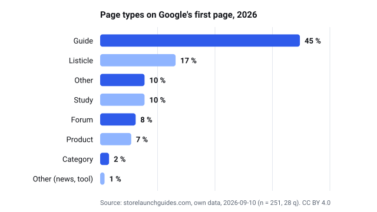
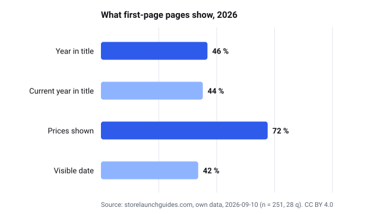

# Shopify guides network — open statistics datasets (CC BY 4.0)

Own data published by the network's sites (11 domains) under [CC BY 4.0](https://creativecommons.org/licenses/by/4.0/): Google first-page studies (and, where the site tracks products, price aggregates). Never per-product prices or third-party text. Reuse figures and charts by crediting the site with a link to its statistics page.

## Datasets

### [Shopify Statistics 2026](https://storelaunchguides.com/statistics/)

- Page with the current version, the method ("How we counted") and the cite box: **[https://storelaunchguides.com/statistics/](https://storelaunchguides.com/statistics/)**
- Downloads (CSV/JSON) on the site itself: [https://storelaunchguides.com/statistics/#download-the-data](https://storelaunchguides.com/statistics/#download-the-data)
- Files in this repository:
  - [serp-2026.csv](storelaunchguides.com/serp-2026.csv)
  - [serp-2026.json](storelaunchguides.com/serp-2026.json)
  - [estudio-serp-2026.svg](storelaunchguides.com/estudio-serp-2026.svg)
  - [estudio-serp-senales-2026.svg](storelaunchguides.com/estudio-serp-senales-2026.svg)

## Free calculators across the network

Each one ships an "Embed" snippet with a visible source link.

- [aussiestoreguides.com/tools/shopify-fee-calculator/](https://aussiestoreguides.com/tools/shopify-fee-calculator/)
- [ehandelsguiden.com/verktyg/shopify-avgiftskalkylator/](https://ehandelsguiden.com/verktyg/shopify-avgiftskalkylator/)
- [espertiecommerce.com/strumenti/calcolatore-commissioni-shopify/](https://espertiecommerce.com/strumenti/calcolatore-commissioni-shopify/)
- [guiatiendaonline.com/herramientas/calculadora-comisiones-shopify/](https://guiatiendaonline.com/herramientas/calculadora-comisiones-shopify/)
- [guideboutiqueenligne.com/outils/calculateur-frais-shopify/](https://guideboutiqueenligne.com/outils/calculateur-frais-shopify/)
- [nettbutikkhjelpen.com/verktoy/shopify-gebyrkalkulator/](https://nettbutikkhjelpen.com/verktoy/shopify-gebyrkalkulator/)
- [shopratgeber.com/tools/shopify-gebuehren-rechner/](https://shopratgeber.com/tools/shopify-gebuehren-rechner/)
- [storeguides.uk/tools/shopify-fee-calculator/](https://storeguides.uk/tools/shopify-fee-calculator/)
- [storelaunchguides.com/tools/shopify-fee-calculator/](https://storelaunchguides.com/tools/shopify-fee-calculator/)
- [swissecomguides.com/tools/shopify-fee-calculator/](https://swissecomguides.com/tools/shopify-fee-calculator/)
- [webwinkelgids.com/tools/shopify-kosten-calculator/](https://webwinkelgids.com/tools/shopify-kosten-calculator/)

## Licence and citation

CC BY 4.0. Attribution: "<site name> — <statistics page URL>". Each CSV carries one row per metric (`metric,value,n,unit,retrievedAt,method`); each JSON is the full aggregate with the method and the snapshot date. The SVG charts are rendered from these files, never from the prose.
